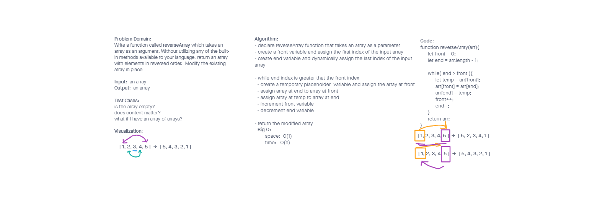

# Reverse an Array

- Write a function called reverseArray which takes an array as an argument. Without utilizing any of the built-in methods available to your language, return an array with elements in reversed order.

# Approach & Efficiency
- To start we utilized inVision to document our Problem Domain and start to Visualize that problem. An algorithm was created to detail a step by step method to achieve the desired outcome. From there we we're able to write our code in JavaScript.
