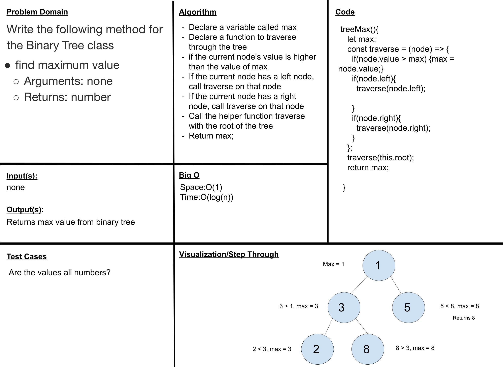

# Trees max

## Challenge 16
Write an instance method called find-maximum-value. Without utilizing any of the built-in methods available to your language, return the maximum value stored in the tree. You can assume that the values stored in the Binary Tree will be numeric.

---

## Approach & Efficiency
I am not the best at expecting time complexity with recursion. I know for a fact it will be at least O(n) for each node in this tree will be touched, and O(1) space as we do not make or use additional space. My best guess would be O(n^2) or something since we are adding two things to the call stack for each node, if each node had two children and so forth.

---

## Solution

