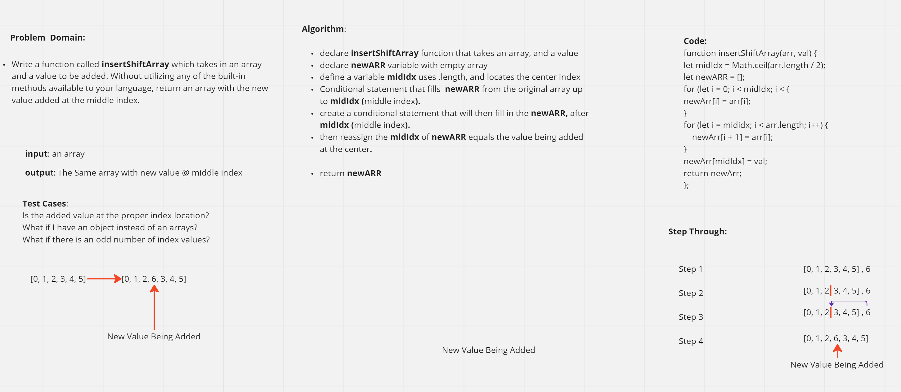

# Insert and Shift an Array

- Create a function called insertShiftArray which takes in an array and a value to be added. Without utilizing any of the built-in methods available to your language, return an array with the new value added at the middle index.

# Whiteboard Process

Approach & Efficiency
Using invision to document our Problem Domain, we visualized the issue at hand. An algorithm was created to detail a step by step process in order to obtain desired results. From there, we produced results by coding in JavaScript
