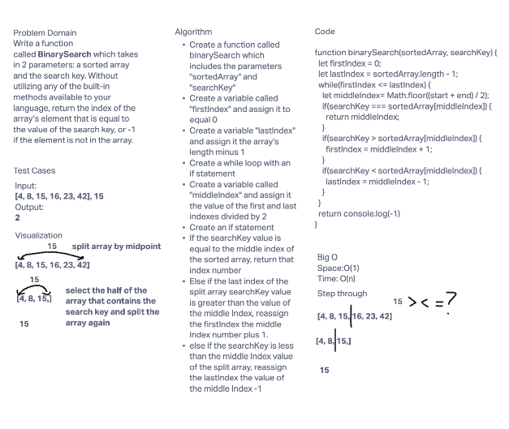

# Binary Search in a Sorted 1D Array

- Create a function called `BinarySearch` which takes in 2 parameters: a sorted array and the search key. Without utilizing any of the build-in methods available to your language, reutrn theindex of array's element tht is equal to the value of the search key, or -1 if the element is not in the array.

## Example:

```
input = [4,8,15,16,23,42], 15
output = 2

input = [11,22,33,44,55,66,77], 90
output = -1
```

# Whiteboard Process


# Approach & Efficiency
The process behind the binary search, is that the size of each search interaction is cut is half until the value is discovered. The first condition to check is if the array is empty or if the value is either below index 0 or higher than the last index. If it's true, the search value is not found and it will return -1. After this, the process moves into a while loop where this will continue to run until a value is found or not. Next step is to see if the middle equals the search value, and if it is, the value is found. If not, the low and high must be adjusted by the search value.
