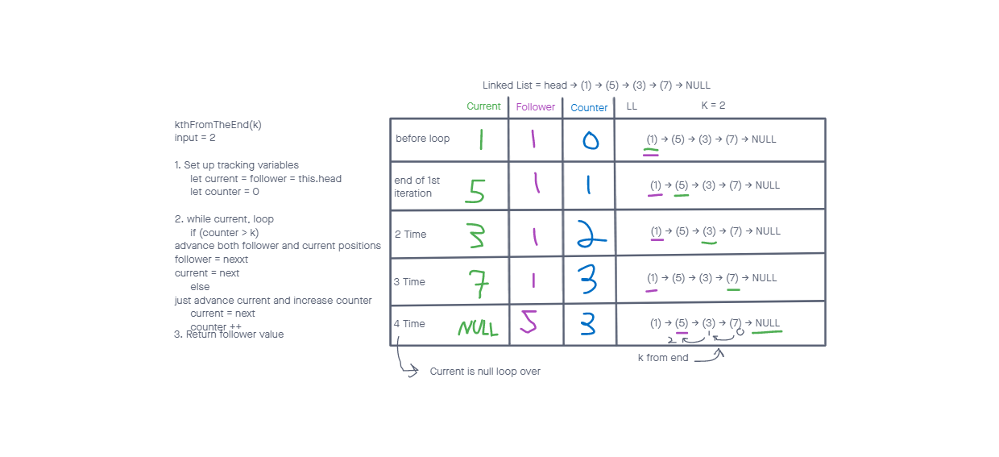

# Challenge 07

# Linked List kth from the end

[Table of Contents](../../../README.md)

[Link to the Code](./linked-list.js)

## Challenge 07
Extending the `LinkedList` class from challenge 06. Added a new method:
- `kthFromEnd(k)`: Takes a number (`k`) and returns the node's value that is `k` from the end of the linked list.

---

### Example:

- `ll.kthFromEnd(k)`:

| Input | Args | Output |
| ----- | ------ | ------ |
| `head -> [1] -> [3] -> [8] -> [2] -> X` | `0` | `2` |
| `head -> [1] -> [3] -> [8] -> [2] -> X` | `2` | `3` |
| `head -> [1] -> [3] -> [8] -> [2] -> X` | `6` | `Exception` |

---

## Approach and Efficiency

To determine the kth from the end of a linked list, I decided to utilize a while loop and keep track of three variables. A counter to let me know when we have set current k steps ahead so we can start moving follower. So I have two pointers current and follower and Follower trails behind current during the while loop, always k steps behind. The big o will always be O(n) for the size of the linkedlist and we use no more additional space than what is given.

---

## Solution

